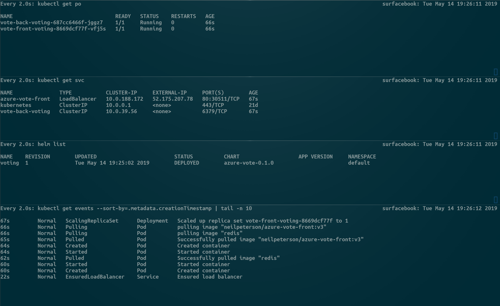
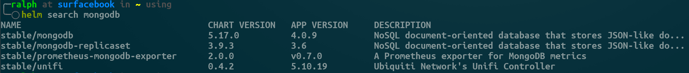
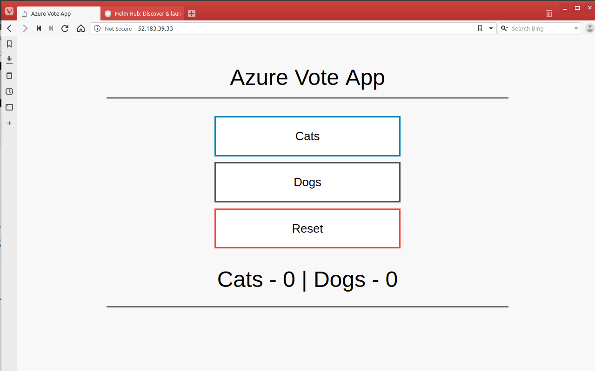
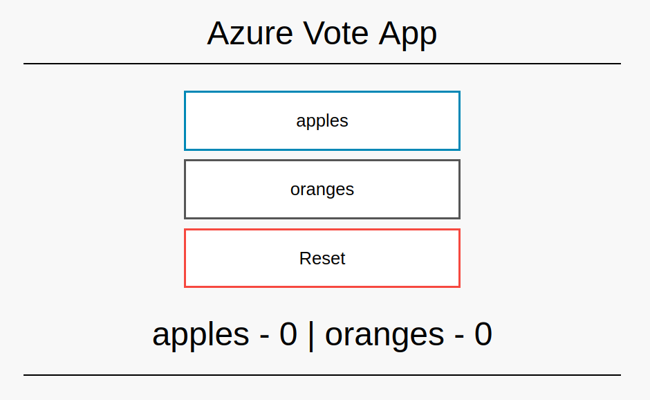

# Installing and using Helm 2 

This directory helps you install and use Helm 2 in a basic way if you're not already familiar with it. (If you are, install Helm 2 with the directions below and move on to [HelloIIS](../HelloIIS/README.md) to create a Windows nodepool and learn about Helm issues with mixed-operating-system clusters.)

The following animated GIF shows the steps that you'll take following this article along with some variations.

## Check for RBAC support
Azure Kubernetes Service (AKS) creates clusters that have RBAC on by default. However, as this set of walkthroughs will work anywhere, let's first ensure that we have RBAC turned on. Run

To ensure your cluster has RBAC enabled, type:

> kubectl api-versions | grep rbac

and you should see the following:

    rbac.authorization.k8s.io/v1
    rbac.authorization.k8s.io/v1beta1

If you do not see any indication that the cluster has RBAC turned on, you're going to need to investigate your cluster creation process. AKS will have RBAC turned on by default.

## Install Helm 2
First, you create the service account and role binding for Tiller -- the server-side component of Helm 2 -- to be able to deploy across the entire cluster. (If you want to narrow the power of your Helm installation and properly lock down other threat vectors, see the [Helm 2 security guidelines](https://helm.sh/docs/using_helm/#securing-your-helm-installation).)

Type and enter:

	kubectl -n kube-system create serviceaccount tiller
	kubectl create clusterrolebinding tiller --clusterrole cluster-admin --serviceaccount=kube-system:tiller

Then, to install Tiller, enter:

	helm init --service-account=tiller 

Wait until the tiller pod is running, which you can check with 

    kubectl get po -l app=helm,name=tiller -n kube-system -w

## Exercise Helm 2

A quick exercise of Helm 2 will give you an idea of a few features like install, upgrade, and uninstall. (For a complete list, enter `helm` with no options.)

First, to easily see what is happening, if you have a console with either tabbing or Windows inside the console, set up four windows with each of the commands in one of the windows in a way that is viewable. (You'll also need the `watch` command, or an equivalent, so find some time to install or locate it.)

1. `watch kubectl get po`
2. `watch kubectl get svc`
3. `watch helm list`
4. `watch "kubectl get events --sort-by=.metadata.creationTimestamp | tail -n 10"` 

It should look something like the following

### Search and install a chart
Let's use `helm search` to find a chart to install something we'd like. For example, mongodb is a common container to use, especially when developing apps prior to pushing to production (in which case the application will often use a native installation or a service like Azure CosmosDB with MongoDB support).

Type and enter:

    helm search mongodb

and you should see something like:

Install a MongoDB service in the cluster with the following command:

    helm install --name mongo stable/mongodb

Not only will the output of Helm describe what was deployed, but the console windows should light up with activity. You should be able to watch both pods, services, and the helm release appear and slowly achieve the desired state. The events pane should display each event that occurs in the stages of completing the deployment, which helps understand the process that Kubernetes follows to ensure the configuration is running.

When you're done examining the installation, you can delete it -- permanently -- with 

    helm delete --purge mongo

**`NOTE:`** You use the `--purge` option in order to remove the release from the operational history. Without it, the release will remain in history, so that it can be easily redeployed. 

### Install and modify release

For this step, we'll use a local chart, which you can imagine you may have just created yourself. This sample is copied into this repository for convenience, but actually is the [Azure Vote](https://github.com/Azure-Samples/helm-charts/tree/master/chart-source/azure-vote) sample in the Azure documentation, derived from the Kubernetes Voting sample. It's not complex, but enables us to understand how to modify the release using Helm.

Assuming you are in the /HelloHelm2 directory (the location of this README), type

    helm install --name voting azure-vote

Notice in the console window that lists the services that the `azure-vote-front` service is initially `Pending` an external IP. Wait until the IP is available, and then copy and paste that IP into a browser. It should look like this:

Now this is a very simple application, but we can modify it all we want. We can update the configuration by scaling it using the --set feature:

    helm upgrade voting azure-vote --set replicaCount=4

This merely scales out the front end pod so that the service has more capacity, it's not really a change of the artifacts running. But you can modify any value in a chart that is exposed in the values.yaml file. For example, let's modify the `Cats` and `Dogs` values we are voting on. Type and enter:

    helm upgrade voting azure-vote --set value1=apples,value2=oranges

Two things happen, if you watch the console values. First, you'll notice that the number of pods acting as the frontend service return to the original chart value of one. Second, we dynamically updated the values you are voting on:

## Understanding release history and deleting the release

Before we delete the application, we examine our release history:

    helm history voting
    
which should appear something like this

    REVISION	UPDATED                 	STATUS    	CHART           	DESCRIPTION     
    1       	Tue May 14 20:47:36 2019	SUPERSEDED	azure-vote-0.1.0	Install complete
    2       	Tue May 14 20:58:21 2019	SUPERSEDED	azure-vote-0.1.0	Upgrade complete
    3       	Tue May 14 20:58:57 2019	SUPERSEDED	azure-vote-0.1.0	Upgrade complete
    4       	Tue May 14 21:01:36 2019	DEPLOYED  	azure-vote-0.1.0	Upgrade complete

You can now experiment with any of the helm commands involving releases, in particular, `helm rollback`. 

Then delete ALL releases at the same time, with

    helm delete --purge voting

## Next Steps
Once you have a cluster created, and you've installed and used Helm, you can browse all the easily available applications you can install and use at https://hub.helm.sh. Then move on to [HelloIIS](../HelloIIS/README.md).