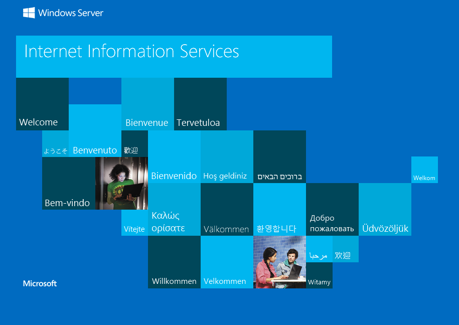
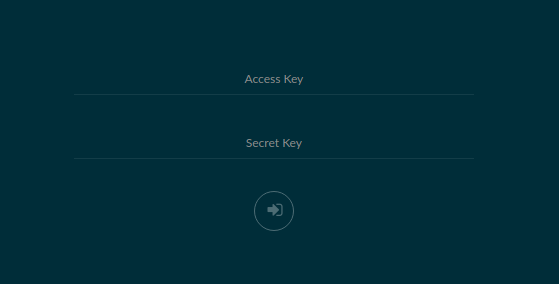

## Helm 3 pre-alpha

## Overview

## Installation
There are canary releases for Linux, Mac, and Windows currently available:

- Linux: `curl https://storage.googleapis.com/kubernetes-helm/helm-dev-v3-linux-amd64.tar.gz --output helm3.linux.tar.gz`
- MacOS: `curl https://storage.googleapis.com/kubernetes-helm/helm-dev-v3-darwin-amd64.tar.gz --output helm3.darwin.tar.gz`
- Windows: `curl https://storage.googleapis.com/kubernetes-helm/helm-dev-v3-windows-amd64.tar.gz --output helm3.windows.tar.gz`

For your operating system, you'll need to put it in your path but with the name `helm3`, and make an alias to it that appends a key value, the "--home" option.

For example, rename your Helm 3 binary to `helm3` and on linux and mac, create an alias that's in your .bashrc or .zshrc file (or another appropriate place) like:

    alias helm3="helm3 --home /home/ralph/.helm3"

Every time I use the **`helm3`** command, it now specifies the appropriate $HELM_HOME value, so that you can run Helm 3 and Helm 2 on the same machine.

Initialize Helm 3 with:

    helm init

and the output -- using the alias values -- should look like:

    Creating /home/ralph/.helm3 
    Creating /home/ralph/.helm3/repository 
    Creating /home/ralph/.helm3/repository/cache 
    Creating /home/ralph/.helm3/plugins 
    Creating /home/ralph/.helm3/starters 
    Creating /home/ralph/.helm3/cache/archive 
    Creating /home/ralph/.helm3/repository/repositories.yaml 
    Adding stable repo with URL: https://kubernetes-charts.storage.googleapis.com 
    $HELM_HOME has been configured at /home/ralph/.helm3.
    Happy Helming!

Now your machine is ready to take Helm 3 for a test drive. Remember, Tiller is still installed, which you can test by entering `kubectl get po -l app=helm,name=tiller -n kube-system`. However, because one of the biggest improvements in Helm 3 is that it doesn't have a server-side component, you can use Helm 2 and Helm 3 in the same cluster. Just remember that neither will know anything about the releases of the other. 

## Using Helm 3 for the same work 

Let's test out Helm 3. For basic work, almost all the commands are the same, but there are two things to note right off. 
1. The `helm install --name <chart>` of version 2 is now an ordinal `helm3 install <name> <chart>` in version 3.
2. Helm 3 now verifies that the chart has an `apiVersion` value of either `v1` (for charts built for Helm 2) or `v2` (for charts built for Helm 3). 

Let's take them one at a time.

## Installing apps with Helm 3

Let's test a few applications out, starting with the one we have already run. First, the voting application.

    helm3 install voting ../HelloHelm2/azure-vote

and sure enough, the proper things happen:

    NAME: voting
    LAST DEPLOYED: 2019-05-14 22:53:45.68046819 -0700 PDT m=+0.482972266
    NAMESPACE: default
    STATUS: deployed

    NOTES:
    The Azure Vote application has been started on your Kubernetes cluster.

    Title: Azure Vote App
    Vote 1 value: Cats
    Vote 2 value: Dogs

    The externally accessible IP address can take a minute or so to provision. Run the following command to monitor the provisioning status. Once an External IP address has been provisioned, brows to this IP address to access the Azure Vote application.

    kubectl get service -l name=azure-vote-front -w

Wait for the IP to be allocated, and hit the application. Cats and Dogs fight again. And we will shortly be able to inject new configurations precisely the same way, but in the canary just downloaded, delete the application first, and then reinstall:

    helm3 delete voting && helm3 install voting ../HelloHelm2/azure-vote --set value1=apples,value2=oranges,replicaCount=8

and you should get quite the deployment. Now we retry the Windows application:

    helm3 install voting ../HelloHelm2/azure-vote --set value1=apples,value2=oranges,replicaCount=8

Finally, we should be able to install the Windows application no problem. And we can:

    helm3 install iis ../HelloIIS/hello-iis-chart

After the IP address appears it's right there (remember this chart deploys to port `:8080`):

## Helm 3 with charts
The second thing that is different with Helm 3 versus Helm 2 matters quite a bit. Helm 2 had a metadata value of `apiVersion` in the Chart.yaml file of a chart, but as it was optional Helm 2 did not enforce it. Forward-looking charts included this value anyway, such as the the example in https://github.com/helm/charts/blob/340194ff5bac4dba78fdfd7e8562728dcf9ddf45/stable/minio/Chart.yaml#L1: there it is, right there. This means that you can install Minio right away.

    helm3 install minio stable/minio

and there you have it. 

What happens when you have a chart that doesn't have the `apiVersion` specified? Let's try to install https://github.com/helm/charts/blob/master/stable/neo4j/Chart.yaml is an example of a chart for a very useful application, Neo4j, that doesn't specify a `apiVersion` in it's chart. It will install with Helm 2, but not with Helm 3.

    helm3 install neo4j stable/neo4j --set acceptLicenseAgreement=yes

You receive: 

    Error: metadata apiVersion is required

## Next Steps

To reset this demo, enter:

    helm list

and delete and purge all the applications you see there with `helm delete --purge <app name>`, and do the same with `helm3 delete <app name>` -- no need for the purge option.

Then, to remove the taints from your nodes enter:

    kubectl get nodes -l beta.kubernetes.io/os=windows -o jsonpath='{range .items[*]}{.metadata.name}{"\n"}' | xargs -I {} kubectl taint nodes {} windows:NoSchedule-

and the result should be something like:

    node/akswindow000000 untainted
    node/akswindow000001 untainted

