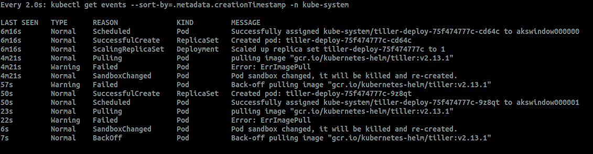

# Helm Charts and Manifests with Windows and Kubernetes Nodes

This repository contains walkthroughs that illustrate some of the issues with Kubernetes Clusters that have mixed node types and shows methods of getting around them properly.

The following is an animated GIF that demonstrates the steps you'll take in this article, with a few variations.

## Manifests and Helm charts with Windows nodes

At the moment, most cluster provisioning tools are creating clusters that by default use exclusively Linux nodes. Version 1.14 of Kubernetes, however, brought Windows nodes into the project officially. This poses one of those lovely problems that happens occasionally: What happens with all those Linux-centric manifests and Helm charts out there in the world? 

Let's take Helm Charts as an example. The general issue is this: almost all the existing, community-created Helm charts and manifests do not specify a [nodeSelector](https://kubernetes.io/docs/concepts/configuration/assign-pod-node/#nodeselector) or [nodeAffinity](https://kubernetes.io/docs/concepts/configuration/assign-pod-node/#node-affinity-beta-feature) by default, because they assumed Linux was the operating system on which the container would run. But Kubernetes doesn't schedule by operating system, it schedules by available resources. That means, all things being equal, that if you have a multi-OS cluster any random Helm chart has containers that are scheduled about half the time on Windows nodes. 

Well, _that won't work_. Even worse for tools like Helm -- and many others without Windows containers -- Helm 2.X's server side component `Tiller` won't schedule on a Windows node (despite the fact that there IS a Windows binary). The error you receive appears in Kubernetes events like this:

For people new to Kubernetes -- and that likely includes lots of Windows developers and app operators -- this kind of failure isn't intuitive to diagnose. In order to be prepared for this, you need to understand why this occurs and what to do about it. (By the way, get any `Pending` pod that constantly restarts with `kubectl get po -o wide` and you'll be able to check whether it was scheduled on a Windows node quickly.)

Here is the basic procedure to follow.

## Step One: Add a Windows NodePool

**`NOTE:`** the node pool name can only be six characters at the current time.

	az aks nodepool add -g $RESOURCE_GROUP --cluster-name $CLUSTER_NAME --os-type Windows -n window -c 2 

This will take a few minutes.

## Step Two: Experience the problem
Let's install precisely the same application, which was built for Linux nodes -- the containers make calls to the Linux kernel. We know this will fail when executed on a Windows node, but what does this look like?

Assuming that you've navigated to the **`HelloIIS`** directory, try to install the same application:

	helm install --name voting ../HelloHelm2/azure-vote

Notice what happens. You might get lucky, and Kubernetes schedules the application for both linux nodes. Typically, however, one of the pods is scheduled on to a Windows node -- and a problem occurs that you can see in the events window. Notice the end of the string that indicates where the pod was assigned (Windows nodes!):

	5m54s       Normal    Scheduled            Pod          Successfully assigned default/vote-back-voting-687cc6466f-fgrvw to akswindow000000
	5m54s       Normal    Scheduled            Pod          Successfully assigned default/vote-front-voting-8669dcf77f-4mdfr to akswindow000001

The pods themselves will never arrive at the **Running** state, but Kubernetes will continue to try for a long time.

	vote-back-voting-687cc6466f-fgrvw    0/1     ImagePullBackOff   0          7m47s
	vote-front-voting-8669dcf77f-4mdfr   0/1     ImagePullBackOff   0          7m47s

Delete the application:

	helm delete --purge voting

## Step Two:  All Windows Nodes should be given a taint value
Now comes the fun. The problem stated above is that we want all charts or manifests to install resources on the appropriate node, which means that components that assume _but do not specifically state_ that they are Windows containers always should be scheduled on Linux nodes. 

How do we do that? By using [taints and tolerations](https://kubernetes.io/docs/concepts/configuration/taint-and-toleration/) with Windows nodes. Taints attach a special value to a supported object (like nodes) that can control what must be or must not be scheduled with an object. When used with nodes, as operators we can properly push deployments that do not state a preference to Linux nodes, and yet support new Windows containers by specifically including a _toleration_ for that tainted node. 

Here's how this works. First, apply a taint for Windows nodes using the `beta.kubernetes.io/os` label, as follows:

	kubectl get nodes -l beta.kubernetes.io/os=windows -o jsonpath='{range .items[*]}{.metadata.name}{"\n"}' | xargs -I {} kubectl taint nodes {} windows=true:NoSchedule

The result should look like:

	node/akswindow000000 tainted
	node/akswindow000001 tainted

Now any application that _should be scheduled on these nodes_ must specify their tolerance for them.

> **NOTE:** There is nothing special about the values used in the `windows=true:NoSchedule` taint. You can use `foo=bar:NoSchedule` here if you see fit (see the taints and tolerations documentation). However, these values are used to set a consistent example, which in operations is all you need. 

## Step Three: Install Helm -- or any other Linux app
Once the Windows nodes have had the `windows=true:NoSchedule` taint applied, all charts or manifests that do not "tolerate" Windows nodes are by default scheduled on Linux. This is the correct approach to multi-OS clusters. 

Now, re-install the same application that failed before when it was scheduled for Windows nodes:

	helm install --name voting ../HelloHelm2/azure-vote

As you watch, you can see that it finds the correct Linux nodes now _every single time_. Try it. And try other applications such as mongodb, or the `stable/wordpress` application. They will schedule correctly.

**`NOTE:`** If you attempt to install Helm on a mixed-OS cluster like this one (before taints are applied), you are likely to fail for the same reason -- only by luck will Tiller be installed on a Linux node. But once the taint is applied to the Windows nodes, the `helm init` command will complete successfully as expected.

## Step Four: All Windows manifests or Helm charts should tolerate the Windows nodes
Now let's use Helm to deploy an application that tolerates those nodes -- an application container that requires a Windows node. If you want to see how a manifest might look, have a look at the `helloIIS.withtolerations.yaml` file in this repository. But for helm, let's deploy the exact same application (a simple Internet Information Services -- IIS -- instance), with a Windows node tolerance, by issuing the following command. From the root of this repository, type:

	helm install --name IIS HelloIIS/hello-iis-chart

The result should be something like:

	NAME:   iis
	LAST DEPLOYED: Sun May 12 22:16:24 2019
	NAMESPACE: default
	STATUS: DEPLOYED

	RESOURCES:
	==> v1/Deployment
	NAME                 READY  UP-TO-DATE  AVAILABLE  AGE
	iis-hello-iis-chart  0/1    1           0          0s

	==> v1/Pod(related)
	NAME                                  READY  STATUS             RESTARTS  AGE
	iis-hello-iis-chart-85b75698b5-vjsb7  0/1    ContainerCreating  0         0s

	==> v1/Service
	NAME                 TYPE          CLUSTER-IP   EXTERNAL-IP  PORT(S)         AGE
	iis-hello-iis-chart  LoadBalancer  10.0.59.227  <pending>    8080:31673/TCP  0s

	NOTES:
	1. Get the application URL by running these commands:
		NOTE: It may take a few minutes for the LoadBalancer IP to be available.
			You can watch the status of by running 'kubectl get --namespace default svc -w iis-hello-iis-chart'
	export SERVICE_IP=$(kubectl get svc --namespace default iis-hello-iis-chart -o jsonpath='{.status.loadBalancer.ingress[0].ip}')
	echo http://$SERVICE_IP:8080

Here's the location for our tolerance in the helm chart HelloIIS/hello-iis-chart/values.yaml file:

	tolerations: 
	- key: "windows"
	  operator: "Equal"
	  value: "true"
	  effect: "NoSchedule"

and you'll notice the same value in the HelloIIS/helloIIS.withtolerations.yaml file as well. Either will install precisely the same application. 

## Step Five: Profit
Performing the following steps in the order specified above results in a good operational habit. The vast majority of helm charts that already exist and which you may want to use will install correctly with no modification onto the proper Linux nodes in a mixed cluster without a problem. You, working on new Windows-specific applications -- perhaps migrating your work to Kubernetes -- can specify the proper Windows node toleration in your chart or manifest in collaboration with your ops team. 

For more details -- perhaps exhaustive -- about Windows on Kubernetes, see https://github.com/kubernetes/enhancements/blob/master/keps/sig-windows/20190103-windows-node-support.md#ensuring-os-specific-workloads-land-on-appropriate-container-host. 

## Next Steps

Now you're ready to use [Helm 3 against both Linux and Windows](../HelloHelm3/README.md). 
